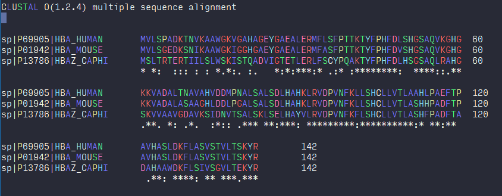

# Syntax high-lighting for Biology specific files

If you're a coder, then you already know how useful the syntax highlighting is for your programming language. However, if you're a biologist and work with lots of biology specific files (fasta, msa, vcf etc) on command-line, then you might have noticed how non-intuitive it feels for manually inspecting them. This tutorial aims to reduce that feeling a little bit and makes working on CLI a bit better!

If you want a hands-on approach with support to custom files, first section covers `nano` text editor syntax coloring and second section for `vim`. If you want a more permanent solution then move on the third section that covers a program called `BioSyntax`. BioSyntax comes with present syntax coloring for pretty much all types of files in Biology/Bioinformatics.

## Nano as the text editor (custom syntax coloring)

For `nano` most settings can be set in `.nanorc` file located in your home directory (`/home/username/.nanorc` or simply `~/.nanorc`).

You can add file specific syntax coloring by editing `.nanorc` file. For example, for nucleotide file (file extensions `.fna` `.fasta` or `.fa`), you can add this section:

```bash
# fasta format nucleotide sequences.
syntax "fasta" "\.fasta$" "\.fas$" "\.fa$"
color brightwhite "^\>.*"
color brightgreen "[Aa]"
color brightred "[Tt]"
color brightblue "[Cc]"
color brightyellow "[Gg]"

```


Similarly, for amino acid fasta files, you can add these lines (ending with `.faa` or `.aa`):


```bash
#colored based on aminoacid properties
syntax "fasta" "\.faa$" "\.aa$"
color brightwhite "^\>.*"
color brightblue "[AILMFWV]"
color brightred "[RK]"
color brightgreen "[NQ]"
color white "[C]"
color magenta "[ED]"
color red "[G]"
color cyan "[HY]"
color brightyellow "[P]"
color green "[ST]"
```


This can also be used for alignment files (nucleotide or proteins) by adding more extensions to the above syntax coloring. You can also add other coloring patterns for other file extensions using the same method.

Other examples:

FASTQ file
```bash
## For FASTQ file
syntax "fastq" "\.fq$" "\.fastq$"
color brightred "^(@|\+).*$"
color brightgreen "^[ATGCN]+$"
```
For DNA sequence in NEXUS/PAUP format

```bash
 "nexus" "\.nexus$" "\.nex$"
color brightgreen "[Aa]"
color brightred "[Tt]"
color brightblue "[Cc]"
color brightyellow "[Gg]"
color brightwhite "(^[  ])\{?[0-9A-Z_!@#$*?-]+\}?"
color brightwhite  start="\[" end="\]"
color brightred "(#NEXUS|End|;)"
color brightyellow "(Dimensions|Format|Matrix)"
color brightcyan "(Begin DATA|ntax|nchar|datatype|gap)"
color brightred "\=\{?[0-9A-Z_!@#$*?-]+\}?"
```

Alignment files (protein)

```bash
## For Protein CLUSTALW format
syntax "clustalw" "\.clw$" "\.aln$"
color brightblue "[AILMFWV]"
color brightred "[RK]"
color brightgreen "[NQ]"
color white "[C]"
color magenta "[ED]"
color red "[G]"
color cyan "[HY]"
color brightyellow "[P]"
color green "[ST]"
```

The screenshot for the above format:




## VIM as the text editor (custom syntax coloring)
