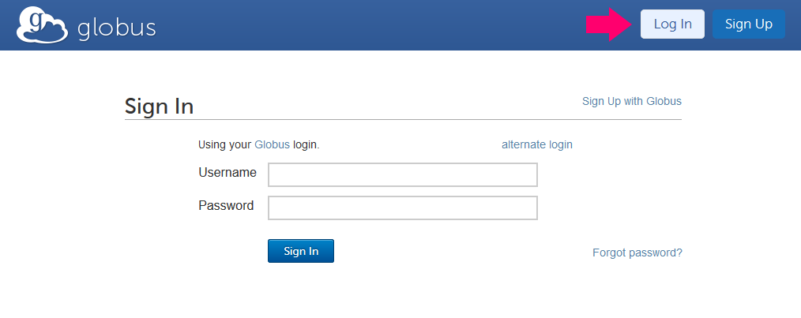
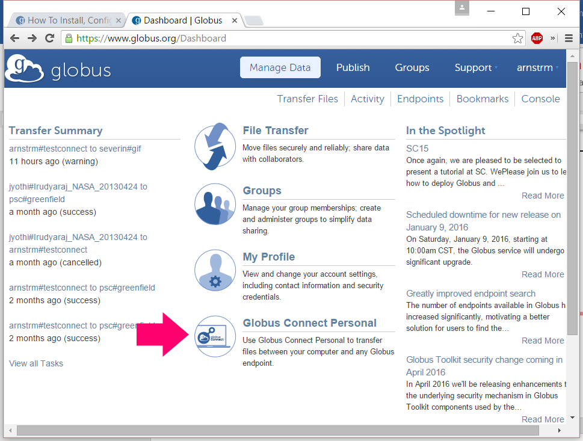
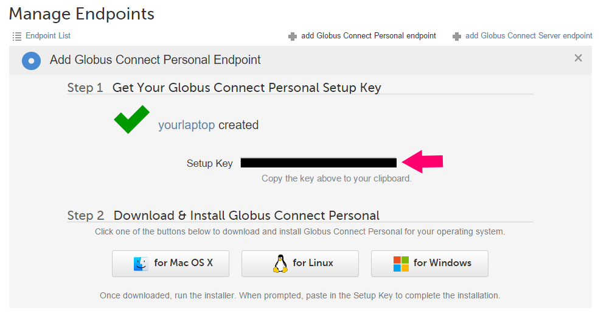
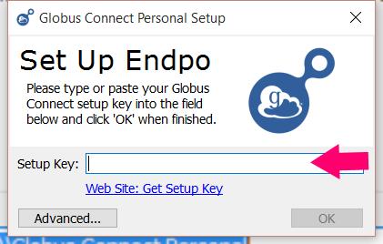
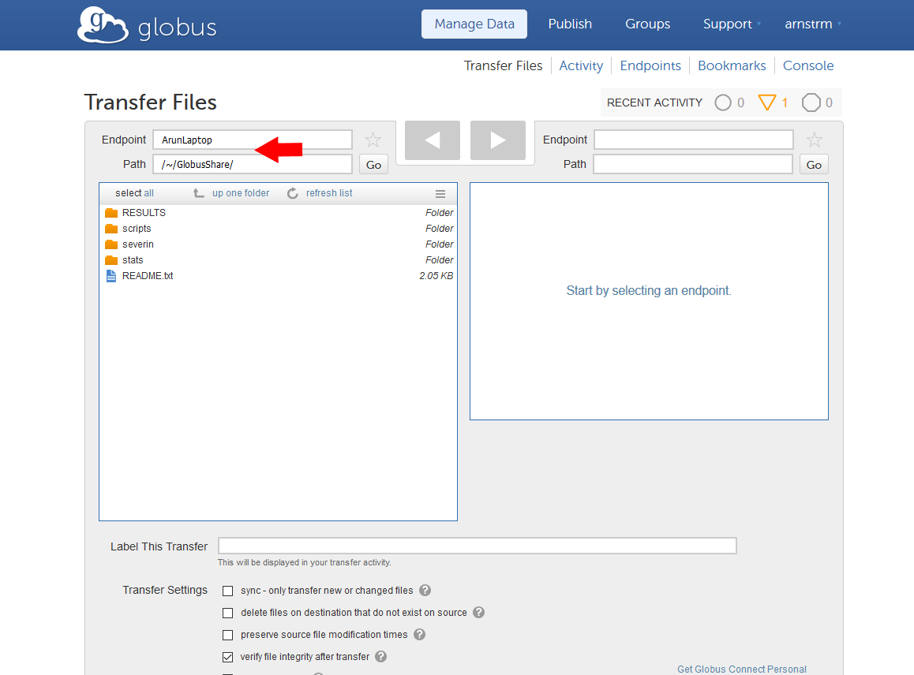
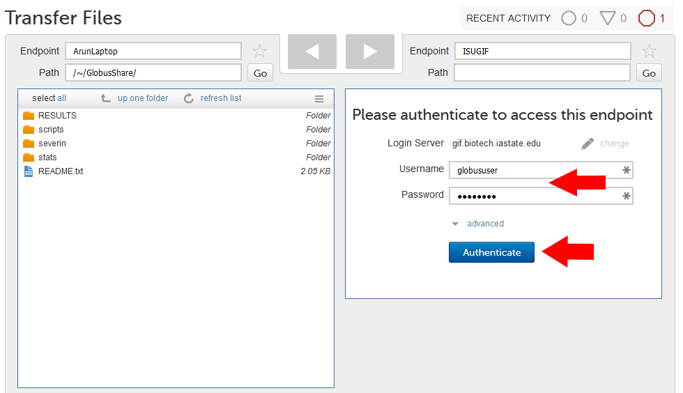
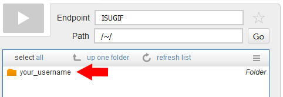
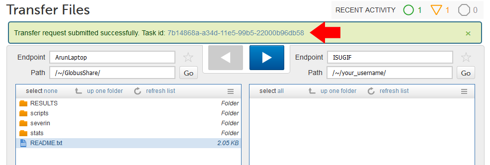

# File Transfer Using Globus Connect Personal (GCP)

This tutorial explains how to transfer files to/from GIF server. You will need Global Connect Personal application to facilitate the file transfer.
Globus Connect Personal turns your laptop or other personal computer into a Globus endpoint and allows you to transfer and share files easily. Follow the instructions to set up a Globus account and transfer files to/from GIF server.

### 1.	Create Globus account and endpoint ###
Go to [https://www.globus.org/SignIn](https://www.globus.org/SignIn) and log in to your Globus account. If you do not have an account already, click `sign up with Globus` and follow the instructions to create an account.

# File Transfer Using Globus Connect Personal (GCP)

After signing in, click on `Globus Connect Personal` to manage endpoints.

Next,

Enter a desired endpoint name in the `Display Name` box and click `Generate Setup Key`. A unique setup key associated with the newly created endpoint will be generated.

Copy this key, since you will need it for next step. Download and install Globus Connect Personal (GCP) to your computer or laptop. During installation, you will be prompted to enter the setup key.

In Windows OS, the default folder for GCP access is Documents. If you would like to change that, click on `Yes, modify settings` and select the desired folder. For Mac users, the home directory is the default folder for GCP access. To modify the preferences, click on GCP icon from the menu extras (upper right corner of the Mac screen) and select preferences. You will see options to change the default folder settings in Access tab.

 

Add the folder by clicking `+` and select the desired folder. To remove access to a folder, select the line and click `-`button at the bottom.   Click `Save` to complete configuration

 
You are now ready to transfer and share files only from/to this directory. Place the files you want to share in this directory.

### 2.	Transferring Files ###
Once you have successfully installed and set up GCP, you can initiate file transfers using a web browser. Log in to https://www.globus.org/ .Click on `Transfer files` (under `Manage Data` as shown below)

 

The left window is the source and right window is the destination/target to copy files.  Click on left window `Endpoint` box, and select `My Endpoints`. Choose the one that you just created in the previous step. Click on the folder to display its contents. NOTE: If you do not see the entire contents, click on `refresh list` icon at the top of the left window.

Now go the destination/target `Endpoint` and search for `arnstrm#isugif`, it should appear as a suggestion below.

Select that, you will be asked for a username and password.

Enter the Username and Password, you received from us. Once the authentication is successful, you will see a folder in your name. Double click the folder to display its contents. Note that the folder may be empty.

 

Select the files you want to transfer (or slect all) and click the blue directional button to start the transfer.

You will see a confirmation saying that the request has been submitted. It might take a few hours to completely transfer the data. The computer must stay on while the transfer is in progress. You may close the browser, if you wish. You will get an email when the transfer is complete.

Once you get the email, you can shut down the computer or exit the Globus application running in the background.
