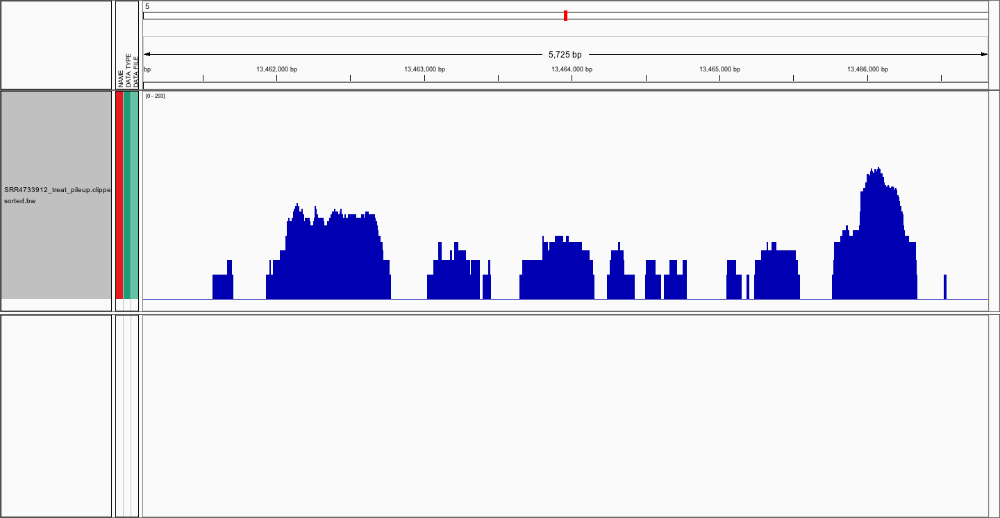

### ATAC-seq tutorial:
The data for this tutorial is based on this [paper; Jégu et al., 2017](http://europepmc.org/backend/ptpmcrender.fcgi?accid=PMC5471679&blobtype=pdf). The authors describe the role of a chromatin remodeling protein in controlling _Arabidopsis_ seedling morphogenesis by modulating chromatin accessibility. They have based their conclusions on a combination of CHIPseq, ATAC-seq, MNAseseq and FAIREseq. In this tutorial, we will work through the ATAC-seq dataset. Check the methods section in the paper for more about how the ATAC-seq


#### Download fastq files directly from ENA website
The fastq files for all the experiments described are available at the ENA website under the bioproject [PRJNA351855](https://www.ebi.ac.uk/ena/data/view/PRJNA351855)
 libraries were prepared. The ATAC-seq data is the only paired end libraries in the list. We can download it directly using wget.
 ```
 wget ftp://ftp.sra.ebi.ac.uk/vol1/fastq/SRR473/002/SRR4733912/SRR4733912_1.fastq.gz
 wget ftp://ftp.sra.ebi.ac.uk/vol1/fastq/SRR473/002/SRR4733912/SRR4733912_2.fastq.gz
 ```

#### Quality Check
 ```
 mkdir Quality_ATAC
 module load fastqc
 fastqc -o Quality_ATAC /path/to/ATAC_paired/*.gz
 ```
 We found that the nextera adapters have already been removed before depositing the sequences. We also confirmed this with the authors.
 

  However, if transposase adapters were present in large amounts the raw reads, we can remove them using one of many adapter trimming programs, for example [cutadapt](http://cutadapt.readthedocs.io/en/stable/guide.html).

#### Download Arabidopsis Genome
Before starting the alignment, we need the _Arabidopsis_ genome, which one can download from either [Araport](https://www.araport.org/data/araport11) or [EnsemblPlants](http://plants.ensembl.org/index.html).

We already have the _Arabidopsis_ genome downloaded, so we  make a `symbolic link or shortcut ` to it and then refer to the link for the making the index.

```
ln -s /path/to/Arabidopsis_thaliana.TAIR10.dna.toplevel.fa At_Genome
```
The shortcut we have made is __At_Genome__

We will use [bowtie2](http://bowtie-bio.sourceforge.net/bowtie2/index.shtml) to align and the following sections describe the making of the index and the alignment.

#### Building the bowtie2 Genome Index
We use environment modules in our cluster, so load the appropriate module and get going.
```
module load bowtie2
mkdir bwt_index
bowtie2-build At_Genome bwt_index/At.TAIR10
```
Because transposase adapters are used in ATAC-seq it is important to check for these adapter sequences and generally perform other quality checks. I

#### Alignment using bowtie2


```
bowtie2 --threads 8 -x bwt_index/At.TAIR10 -q -1 ATAC_paired/SRR4733912_1.fastq.gz -2 ATAC_paired/SRR4733912_2.fastq.gz -S bwt_out/SRR4733912.sam
```

__Convert SAM to bam and sort__
```
 samtools view --threads 7 -bS SRR4733912.sam | samtools sort --threads 7 - > SRR4733912.sorted.bam
 ```
View the header of the sorted BAM file:

```
samtools view -H SRR4733912.sorted.bam
 @HD     VN:1.0  SO:coordinate
 @SQ     SN:1    LN:30427671
 @SQ     SN:2    LN:19698289
 @SQ     SN:3    LN:23459830
 @SQ     SN:4    LN:18585056
 @SQ     SN:5    LN:26975502
 @SQ     SN:Mt   LN:366924
 @SQ     SN:Pt   LN:154478
 @PG     ID:bowtie2      PN:bowtie2      VN:2.2.6        CL:"/opt/rit/app/bowtie2/2.2.6/bin/bowtie2-align-s --wrapper basic-0 --threads 8 -x bwt_index/At.TAIR10 -q -S bwt_out/SRR4733912.sam -1 /tmp/26409.inpipe1 -2 /tmp/26409.inpipe2"
 ```

__Index the BAM file__
 ```
 samtools index SRR4733912.sorted.bam
```
 the index file is `SRR4733912.sorted.bam.bai`

 It is important to identify and remove reads aligning to __Mt and Chloroplast__ in case of ATAC-seq because this can cause confounding signals.
 ```
 samtools idxstats SRR4733912.sorted.bam | cut -f1 | grep -v Mt | grep -v Pt | xargs samtools view --threads 7 -b SRR4733912.sorted.bam > SRR4733912.sorted.noorg.bam
```
We call the BAM file without chloroplastic and mitochondrial alignments as `SRR4733912.sorted.noorg.bam`

 One can compare the index stats of the BAM file without organellar DNA alignments and the file with all alignments. You can use this to bench mark the alignment and the procedure used to make the libraries.
```
 samtools idxstats SRR4733912.sorted.noorg.bam
 1       30427671        2018268 43655
 2       19698289        2796545 47708
 3       23459830        1738071 36100
 4       18585056        1290746 26515
 5       26975502        1795689 40246
 Mt      366924  0       0
 Pt      154478  0       0
 *       0       0       3016596
########################################################

 samtools idxstats SRR4733912.sorted.bam
 1       30427671        2018268 43655
 2       19698289        2796545 47708
 3       23459830        1738071 36100
 4       18585056        1290746 26515
 5       26975502        1795689 40246
 Mt      366924  2469591 35167
 Pt      154478  44476436        524929
 *       0       0       3016596
```
#### PEAK Calling
 We can now call the peaks/pileups of reads in our sample. We use [macs2](https://github.com/taoliu/MACS) for that. However there are other peak callers as well. macs2 was designed originally for CHIPseq but works just as well for ATAC-seq.

```
  macs2 callpeak -t /path/to/SRR4733912.sorted.noorg.bam -q 0.05 --broad -f BAMPE -n SRR4733912 -B --trackline --outdir . &>SRR4733912.peak.log&
```
_Important Parameters used:_
```
 Used a local lambda for noise reduction in the vicinity of peaks.
 # ARGUMENTS LIST:
 # name = SRR4733912
 # format = BAMPE
 # ChIP-seq file = ['../bwt_out/SRR4733912.sorted.noorg.bam']
 # control file = None
 # effective genome size = 2.70e+09
 # band width = 300
 # model fold = [5, 50]
 # qvalue cutoff for narrow/strong regions = 5.00e-02
 # qvalue cutoff for broad/weak regions = 1.00e-01
 # Larger dataset will be scaled towards smaller dataset.
 # Range for calculating regional lambda is: 10000 bps
 # Broad region calling is on
 # Paired-End mode is on
 # mean fragment size is determined as 139 bp from treatment
 # fragments after filtering in treatment: 4002590
```
The following files will be output:
```
SRR4733912_control_lambda.bdg
SRR4733912_peaks.broadPeak
SRR4733912_peaks.gappedPeak
SRR4733912_peaks.xls
SRR4733912_treat_pileup.bdg
```
We have the treatment pileup bedgraph file `SRR4733912_treat_pileup.bdg`, which we can convert to a bigwig format to view in a browser, e.g., IGV. We can download a few program available from UCSC(https://genome.ucsc.edu/); `bedClip` and `bedGraphToBigWig`. We will also make use of [bedtools](http://bedtools.readthedocs.io/en/latest/).

__Make a chromsome sizes file__
```
bioawk -c fastx '{print $name, length($seq)}' /path/At_Genome > At_chr.sizes
```

__Clip the bed graph files to correct coordinates__
 ```
 bedtools slop -i SRR4733912_treat_pileup.bdg -g At_chr.sizes -b 0 | /path/to/bedClip stdin At_chr.sizes SRR4733912_treat_pileup.clipped.bdg
```

__Sort the clipped files__
 ```
 sort -k1,1 -k2,2n SRR4733912_treat_pileup.clipped.bdg > SRR4733912_treat_pileup.clipped.sorted.bdg
```

__Convert to bigwig__
```
 /path/to/bedGraphToBigWig SRR4733912_treat_pileup.clipped.sorted.bdg At_chr.sizes SRR4733912_treat_pileup.clipped.sorted.bw
 ```

 We can directly view the bigwig file in the IGV Genome browser or calculate peak scores over a genomic region/interval using UCSCs's [bigwigaverageoverbed](https://bioconda.github.io/recipes/ucsc-bigwigaverageoverbed/README.html).

 
