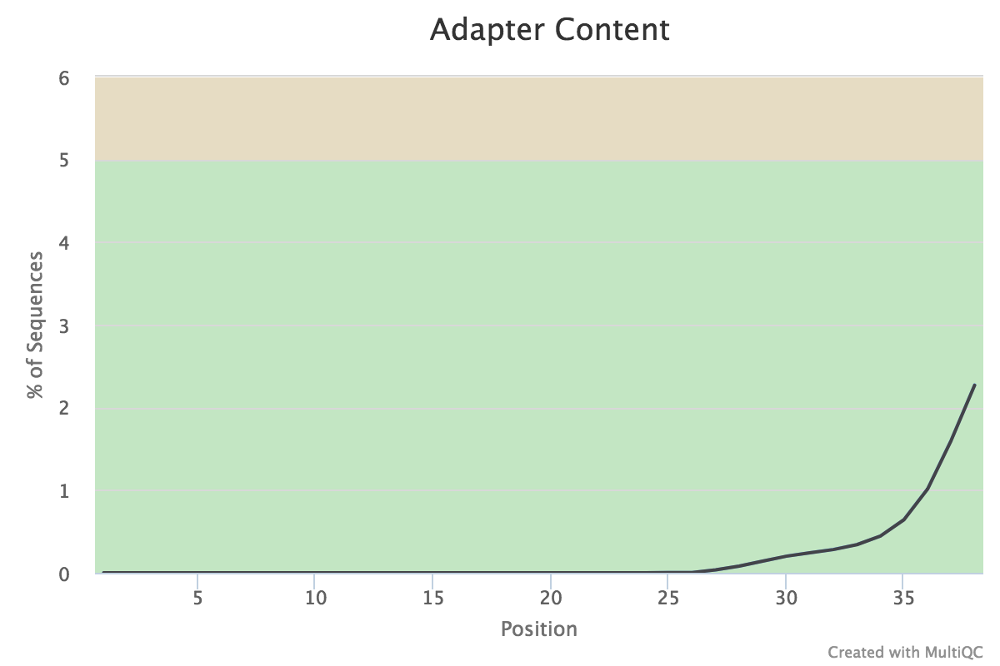

### ATAC-seq tutorial:
The data for this tutorial is based on this [paper](http://europepmc.org/backend/ptpmcrender.fcgi?accid=PMC5471679&blobtype=pdf). The author's describe a chromatin remodeling protein in Arabidopsis seedling morphogenesis. They have based their conclusions on a combination of CHIPseq, ATAC-seq, MNAseseq and FAIREseq. In this tutorial, we will work through the ATAC-seq dataset. Check the methods section in the paper for more about how the ATAC-seq


__Download fastq files directly from ENA website__
The fastq files for all the experiments described are available at the ENA website under the bioproject [PRJNA351855](https://www.ebi.ac.uk/ena/data/view/PRJNA351855)
 libraries were prepared. The ATAC-seq data is the only paired end libraries in the list. We can download it directly using wget.
 ```
 wget ftp://ftp.sra.ebi.ac.uk/vol1/fastq/SRR473/002/SRR4733912/SRR4733912_1.fastq.gz
 wget ftp://ftp.sra.ebi.ac.uk/vol1/fastq/SRR473/002/SRR4733912/SRR4733912_2.fastq.gz
 ```
__Download Arabidopsis Genome__
Before starting the alignment, we need the _Arabidopsis_ genome, which one can download from either [Araport](https://www.araport.org/data/araport11) or [EnsemblPlants](http://plants.ensembl.org/index.html).

We already have the _Arabidopsis_ genome downloaded, so we  make a `symbolic link or shortcut ` to it and then refer to the link for the making the index.

```
ln -s /path/to/Arabidopsis_thaliana.TAIR10.dna.toplevel.fa At_Genome
```
The shortcut we have made is __At_Genome__

We will use bowtie2 to align and the following section describes that aspect.

__Building the Genome Index__
We use environment modules in our cluster, so load the appropriate module and get going.
```
module load bowtie2
mkdir bwt_index
bowtie2-build At_Genome bwt_index/At.TAIR10
```
Because transposase adapters are used in ATAC-seq it is important to check for these adapter sequences and generally perform other quality checks. I

__Quality Check__
```
mkdir Quality_ATAC
module load fastqc
fastqc -o Quality_ATAC /path/to/atac_data/public/sra/*.gz
```
We found that the nextera adapters have already been removed before depositing the sequences. We also confirmed this with the authors.


 However, it was found that transposase adapters were present in large amounts the raw reads, we can remove them using one of many apter trimming programs, for example [cutadapt](http://cutadapt.readthedocs.io/en/stable/guide.html).
