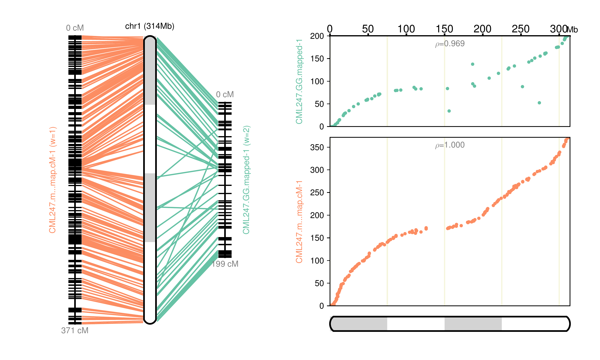
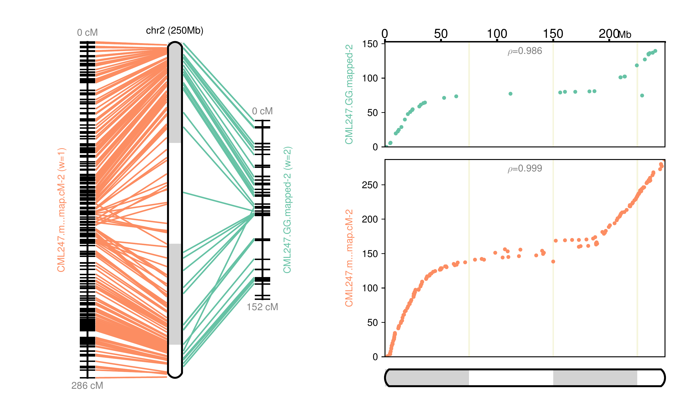
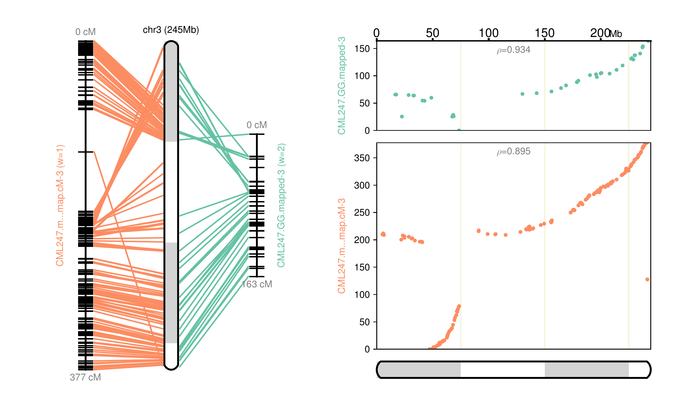
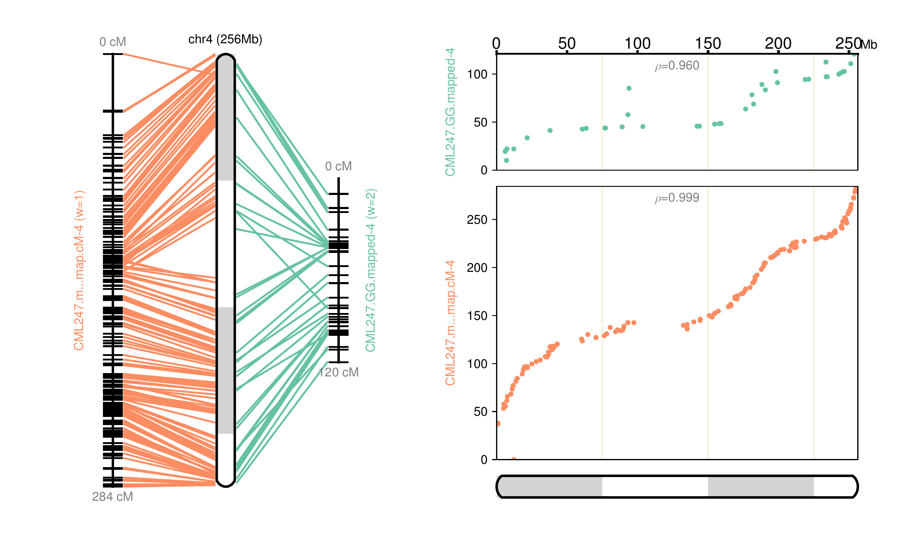
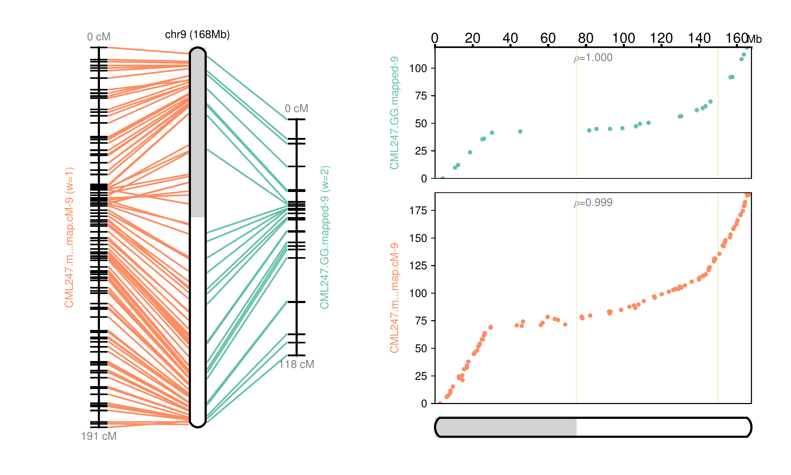
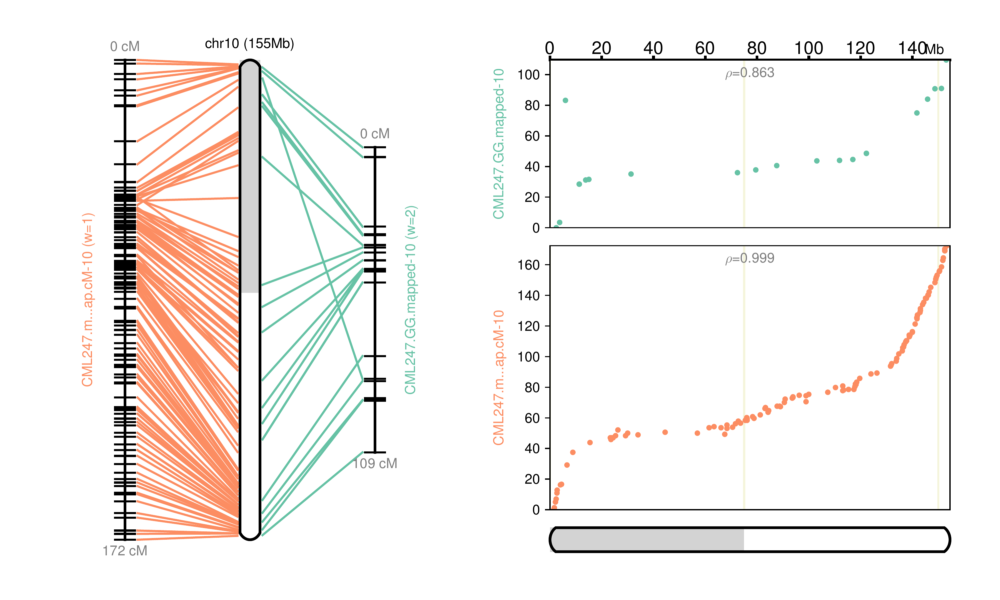

# Scaffolding Genomes using Genetic map

In the previous section, we developed a genetic map for maize NAM founder line CML247 using the GBS dataset from [_Wallace et. al._](https://journals.plos.org/plosgenetics/article?id=10.1371/journal.pgen.1004845). The original paper ([_McMullen et. al._](http://science.sciencemag.org/content/325/5941/737)) that created this NAM population also had genetic markers for all the NAMs, albeit few but great quality (referred as Golden Gate markers, based on technology used). Together, they make great resource for various applications. Here, we will use them as genetic map, mapping them to publicly available CML247 genome and creating pseduomolecules from the scaffolds. A quick note: CML247 genome already has pseudomolecules (12), but for this exercise, we will break them to create artificial scaffolds (39) and then put them together using genetic map.

## Dataset

1. From the previous section, we need the `results_onemap.txt`, genetic map that we created for CML247.
2. [MaizeGDB](https://www.maizegdb.org/data_center/pos?id=1167939) hosts the original markers developed by [_McMullen et. al._](http://science.sciencemag.org/content/325/5941/737). The markers can be downloaded as separate files for each chromosome. We refer them as GoldenGate markers (based on technology used to develop this). This was originally developed for V2 of B73, but MaizeGDB manually processed them and lifted them over for V3. The original file also had some sequences instead of co-ordinates, which can also be used for our purpose  

3. A genome to scaffold. We need to have the same genome for which the map was developed and preferably as scaffolds. MaizeGDB hosts a version of [CML247](https://www.maizegdb.org/genome/genome_assembly/Zm-CML247-DRAFT-PANZEA-1.0) that can be used for this exercise.

### Obtaining datasets

GBS markers from pervious section is available [here](assets/results_onemap.txt).

GoldenGate Markers can be downloaded using `wget` commands

```bash
wget -O CML247_1203657.map https://www.maizegdb.org/map_text?id=1203657
wget -O CML247_1203882.map https://www.maizegdb.org/map_text?id=1203882
wget -O CML247_1203682.map https://www.maizegdb.org/map_text?id=1203682
wget -O CML247_1203707.map https://www.maizegdb.org/map_text?id=1203707
wget -O CML247_1203732.map https://www.maizegdb.org/map_text?id=1203732
wget -O CML247_1203757.map https://www.maizegdb.org/map_text?id=1203757
wget -O CML247_1203782.map https://www.maizegdb.org/map_text?id=1203782
wget -O CML247_1203807.map https://www.maizegdb.org/map_text?id=1203807
wget -O CML247_1203832.map https://www.maizegdb.org/map_text?id=1203832
wget -O CML247_1203857.map https://www.maizegdb.org/map_text?id=1203857
```
other markers:

```bash
wget http://de.iplantcollaborative.org/dl/d/B323A70C-F0D8-4BEF-9707-FD8198B5251C/NAM_map_and_genos-120731.zip
unzip NAM_map_and_genos-120731.zip

```
Note: The excel file is not readable CLI, so we save it as tsv. The converted format is also saved in this repo and can be found [here](assets/all_markers.txt).


Scaffolds for `CML247` can also be downloaded from MaizeGDB using `wget` command

```
wget https://ftp.maizegdb.org/MaizeGDB/FTP/Zm-CML247-DRAFT-PANZEA-1.0/Zm-CML247-DRAFT-PANZEA-1.0.fasta.gz
gunzip Zm-CML247-DRAFT-PANZEA-1.0.fasta.gz
mv gunzip Zm-CML247-DRAFT-PANZEA-1.0.fasta CML247-chr.fa
```

Apart from these primary datasets, we will also need additional data for this tutorial. First, the GoldenGate markers were developed for version 3, And GBS map was developed using the version 4, so we need both these genomes to extract marker sequences.

```bash
wget https://ftp.maizegdb.org/MaizeGDB/FTP/Zm-B73-REFERENCE-GRAMENE-4.0/Zm-B73-REFERENCE-GRAMENE-4.0.fa.gz
wget ftp://ftp.ensemblgenomes.org/pub/plants/release-22/fasta/zea_mays/dna/Zea_mays.AGPv3.22.dna.toplevel.fa.gz
gunzip *.gz
```

Second, for getting the positions for the markers that we generated, we need the co-ordinates for them. This information is located in the VCF file (cleaned), that we used in the previous section (found [here](/assets/B73xCML247_cleaned.vcf)).

Third, we need to singularity container for running ALLMAPS

```bash
module load singularity
singularity pull docker://tanghaibao/jcvi
```

## Steps

1. Prepare the genome: index it with HiSat2 aligner that is suitable to align short reads such as markers.
2. Extract the markers for both maps.
3. Map the markers to the genome (separately)
4. Merge these markers and create a weights file (GoldenGate markers need to be weighed higher than GBS markers)
5. Run ALLMAPS and create AGP file as well as Pseduomolecules for CML247.

### Organization

We will organize the working directory this way:

```
CML247
├── 0-index
├── 1-onemap
├── 2-goldengate
└── 3-allmaps
```
 `0-index` will hold the HiSat2 index files for the scaffolds, We will carryout processing OneMap and GoldenGate maps in `1-onemap` and `2-goldengate` respectively. And finally run ALLMAPS in `3-allmaps` folder.

### Preparing genome

Create a script for indexing genome `00_build_index_hisat2.sh`

```bash
#!/bin/bash
if [ "$#" -ne 2 ] ; then
echo "please provide:"
echo -e "\t\t(1) name for index, preferably the NAM line name"
echo -e "\t\t(2) genome sequences, use only scaffolds"
echo "";
echo "./00_build_index_hisat2 <NAM name> <FASTA-scaffolds-file>" ;
echo "";
exit 0;
fi

NAM=$1
file=$2
module load hisat2
hisat2-build ${file} $NAM
```
But the genome we downloaded are already in Chromosome level assembly! As we don't have a real scaffolds to work with, we will break this every 750Mb and generate "scaffolds" to show the utility of this exercise. Do these steps in `0-index`.

To split them we will use UCSC kent-util package.

```bash
faSplit size CML247-chr.fa 75000000 CML247-scf -oneFile
```
This will break the 11 pseudomolecules in to 39 "scaffolds"

Next, index them:

```bash
./00_build_index_hisat2.sh CML247 CML247-scf.fa
```

### Processing OneMap genome map:

Split the OneMap genetic map to different chromosomes and check if they are consistent. Genetic map programs identify chromosome names based on the size (largest to smallest). While it works for most genomes, in maize the sizes are not in descending order, so we will have to rename them to correct chromosomes. Run these steps in `1-onemap`. Place the VCF file and onemap results file in this directory. We will create a series of scripts and run them to achieve this:

`om1_splitOnemap.sh`

```bash
#!/bin/bash
# run this onemap result file
# splits them based on linkage groups to check consistency
if [ "$#" -ne 1 ] ; then
echo "please provide the onemap results file";
fi

file="$1"
base=$(basename ${file%.*} |cut -f 1 -d "_")
min=$(cut -f 1 -d " " ${file} | awk 'NF>0' | sort -n | uniq | head -n 1)
max=$(cut -f 1 -d " " ${file} | awk 'NF>0' | sort -n | uniq | tail -n 1)
for i in $(seq ${min} ${max}); do
awk -v x=$i '$1==x' $file | sed 's/ /,/g' > ${base}_onemap_chr${i}.csv;
done
```

`om2_CheckSplitsConsistency.sh`
```bash
#!/bin/bash
# checks the split onemap results for consistency
if [ "$#" -ne 1 ] ; then
echo "please provide split onemap result file";
exit 0;
fi
file="$1"
lg=$(cut -f 1 -d "," $file | sort | uniq)
markers=$(cut -f 2 -d "," $file | cut -f 1 -d "_" | sort | uniq -c | awk 'BEGIN{ORS=";"}{print $2"("$1")"}');
echo -e "${file%.*}\t${lg}\t${markers}";
# count number of markers in each linkage group and warn if they have less than 10
count=$(cat $file |wc -l)
if [ "${count}" -lt "10" ] ; then
echo "$(tput setaf 1)$file has less than 10 markers$(tput sgr0)";
fi
```

`om3_FixLinkageGroupName.sh`
```bash
#!/bin/bash
# correct the linkage group to the actual chromosome name based on B73 naming
if [ "$#" -ne 1 ] ; then
echo "please provide a NAM name for the marker file";
exit 0;
fi
file="$1"
correct=$(cut -f 2 -d "," $file | cut -f 1 -d "_" | sed 's/S//g' | sort | uniq -c | awk '{print $2"\t"$1}' | sort -k 2 -n | tail -n 1 |cut -f 1);
current=$(cut -f 1 -d "," $file | sort | uniq )
awk -v x=${correct} 'BEGIN{OFS=FS=","} $1=x'  $file > ${file%.*}_right.csv
echo "the linkage group was listed as $current but was changed to $correct"
```
`om4_MakeMarkerFile.sh`
```bash
#!/bin/bash
# run this on right files
# merges them to one file
if [ "$#" -ne 1 ] ; then
echo "please provide a NAM name for the marker file";
exit 0;
fi
base=$1
rm ${base}_onemap-cM.csv 2>/dev/null;
cat *_right.csv | grep -v "^chr" >> ${base}_onemap-cM.csv;
```

`om5_ExtractAndMapMarkers.sh`

*_Note: the B73V4 path at Line16, should be corrected before running this script_*

```bash
#!/bin/bash
if [ "$#" -ne 4 ] ; then
echo "please provide:"
echo -e "\t\t(1) path for hisat2 indexed NAM genome (without ht2 extension)"
echo -e "\t\t(2) csv marker file checked, processed and merged"
echo -e "\t\t(3) VCF file to obtain co-ordinates for the markers"
echo -e "\t\t(4) NAM line name for naming the output file"
echo "";
echo "./om5_ExtractAndMapMarkers.sh <index_path> <csv_file> <vcf_file> <NAM-name>" ;
echo "";
exit 0;
fi
module load bedtools2
module load hisat2
module load samtools
B73v4="Zm-B73-REFERENCE-GRAMENE-4.0.fa"
# full path for ht2 files
index="$1"
# full path for markers csv file
csv="$2"
# NAM genome
#genome="$3"
# vcf file for locations
vcf="$3"
# full nam name eg Ki3
full="$4"
# convert the genetic map to tab and only keep SNP name and genetic distance
sed 's/,/\t/g' $csv | grep -v "chr" | cut -f 2,3 > marker_distnace.txt
# get the B73.V4 locations for SNPs from the subsetted VCF file
grep -Fw -f <(cut -f 1 marker_distnace.txt) ${vcf} | awk '{print $3"\t"$1"\t"$2}' > marker_locations.txt
# merge locations with distance and create a bed file for extracting marker sequence
# uses 50bp up and down from the SNP location
awk 'BEGIN{OFS=FS="\t"}FNR==NR{a[$1]=$2 FS $3;next}{ print $0, a[$1]}' marker_distnace.txt marker_locations.txt |\
  sed 's/ //g' |\
  awk 'BEGIN{OFS=FS="\t"}{print $2,$3-50,$3+50,$1,$4,"+"}' > markers_locations_distance.bed
# use bedtools to extract marker sequence
bedtools getfasta -fi ${B73v4} -fo ${full}_markers.fasta -bed markers_locations_distance.bed -name
# save marker sequnce as variable
markers=${full}_markers.fasta
# generate index for the genome
#hisat2-build ${genome} ${base}_index
# map marker sequence to the indexed genome
hisat2 -p 12 --mp 1,1 --no-softclip -f -x $index -U ${markers}  -S ${markers%.*}_mapped.sam &> mapping_stats.txt
# convert sam to bam and then sort
samtools view -b -o ${markers%.*}_mapped.bam ${markers%.*}_mapped.sam
samtools sort -o ${markers%.*}_mapped_sorted.bam ${markers%.*}_mapped.bam
# save the marker name and location they map
bedtools bamtobed -i ${markers%.*}_mapped_sorted.bam |  awk '{print $4"\t"$1"\t"$2}' > ${markers%.*}_part1.txt
# get the linkage group from the genetic map
awk 'BEGIN{OFS=FS=","} {print $2,$1,$3}' $csv | sed 's/,/\t/g' > ${markers%.*}_part2.txt
# write a csv file merging the part1 and part2 file
echo "Scaffold ID,scaffold position,LG,genetic position" > ${full}_mapped_onemap-cM.csv
awk 'BEGIN{OFS=FS="\t"}FNR==NR{a[$1]=$2 FS $3;next}{ print $0, a[$1]}' ${markers%.*}_part2.txt ${markers%.*}_part1.txt | \
  sed 's/ //g' | \
  cut -f 2- | \
  sed 's/\t/,/g' >> ${full}_mapped_onemap-cM.csv
```


Now run all these scripts as follows:

```
./om1_splitOnemap.sh results_onemap.txt
for f in *.csv; do
   ./om2_CheckSplitsConsistency.sh $f;
done
for f in *.csv; do
   ./om3_FixLinkageGroupName.sh $f;
done
./om4_MakeMarkerFile.sh CML247
om5_ExtractAndMapMarkers.sh ../0-index/CML247 CML247_onemap-cM.csv B73xCML247_cleaned.vcf CML247
```

The final result will be the mapping position of the markers on the draft genome, in a CSV format (`CML247_mapped_onemap-cM.csv`). The scripts will also output other useful information such as how many markers were found per chromosomes, how many was extractable (sequence), chromosome names identified by OneMap and what was it changed to, number of mapping markers etc., Please double check these numbers to make sure the script is doing what it is supposed to do.

stdout:
```
results_onemap_chr10    10      S10(126);
results_onemap_chr1     1       S1(209);
results_onemap_chr2     2       S2(186);S7(1);
results_onemap_chr3     3       S3(170);S8(1);
results_onemap_chr4     4       S4(172);
results_onemap_chr5     5       S5(188);
results_onemap_chr6     6       S6(132);
results_onemap_chr7     7       S7(115);
results_onemap_chr8     8       S8(129);
results_onemap_chr9     9       S9(114);
the linkage group was listed as 10 but was changed to 10
the linkage group was listed as 1 but was changed to 1
the linkage group was listed as 2 but was changed to 2
the linkage group was listed as 3 but was changed to 3
the linkage group was listed as 4 but was changed to 4
the linkage group was listed as 5 but was changed to 5
the linkage group was listed as 6 but was changed to 6
the linkage group was listed as 7 but was changed to 7
the linkage group was listed as 8 but was changed to 8
the linkage group was listed as 9 but was changed to 9
```

Also, copy the results to `3-allmaps` directory:

```bash
cp CML247_mapped_onemap-cM.csv ../3-allmaps/
```


### Processing GoldenGate markers:

The steps are similar, but these markers are slightly in different format (run these in `2-goldengate` folder) First, the markers are relatively small, so in order to make them mappable we need to extract some flanking sequences. Second, the co-ordinates are given for V3 of B73. Again, for processing GoldenGate markers, we will setup a series of scripts and run them at the end.


`gg1_ProcessMaizeGDBmaps.sh`

*_Note: the B73V3 path at line18 and `all_markers.txt` file path at line 19 of this script should be corrected before running this script_*

```bash
#!/bin/bash
if [ "$#" -ne 2 ] ; then
echo "please provide:"
echo -e "\t\t(1) text file for markers downloaded from MaizeGDB, each CHR should be in separate file"
echo -e "\t\t(2) NAM line name for naming the output file"
echo "";
echo "./gg1_ProcessMaizeGDBmaps.sh <maizegdb file> <NAM-name>" ;
echo "";
exit 0;
fi
# load needed modules
module use /work/GIF/software/modules
module load cdbfasta
module load GIF/maker
module load bioawk
module load bedtools2
# initialize variables
ref="Zea_mays.AGPv3.22.dna.toplevel.fa"
markers="all_markers.txt"
# nam line name eg: Ki3
nam="$2"
# maizeGDB file (tsv format)
file="$1"
# read the file and choose the linkage group based on the markers mapping to B73 chr
chr=$(cut -f 5 $file |grep -v "C_v3" |sort |uniq -c |awk 'NF>1 {print $2"\t"$1}' |sort -k2,2 -rn |head -n 1 |cut -f 1)
# write a bed file for all markers with co-ordinates
cut -f 1,2,6 $file | awk 'NF==3' | sed 's/,//g' | awk -v x=$chr '{print x"\t"$3"\t"$3+100"\t"$1"\t"$2"\t+"}' > ${nam}_chr${chr}.bed
# extract the markers
bedtools getfasta -fi $ref -bed ${nam}_chr${chr}.bed -name > ${nam}_chr${chr}.fasta
# write a marker file with cM info
awk 'BEGIN{OFS=FS="\t"}{print $1"\t"$4"\t"$5}' ${nam}_chr${chr}.bed > ${nam}_chr${chr}.tsv
# markers without co-ordinates but with sequences instead
cut -f 1,2,6 $file | awk 'NF<3' | awk '{print $1}' > ${nam}_chr${chr}.notfound
# add them to the marker file with cM info and to the fasta file
grep -F -f ${nam}_chr${chr}.notfound $file | awk -v x=$chr 'NF==3 {print x"\t"$1"\t"$2}' >> ${nam}_chr${chr}.tsv
grep -F -f ${nam}_chr${chr}.notfound $file | awk 'NF==3 {print ">"$1"\n"$3}' >> ${nam}_chr${chr}.fasta
# another attempt to recover markers from Maggies data
cut -f 2 ${nam}_chr${chr}.tsv > ${nam}_chr${chr}.present
cut -f 1 $file | grep -v "Locus" | grep -Fwv -f ${nam}_chr${chr}.present > ${nam}_chr${chr}.absent
# Maggie's marker file

# info extracted and written to a bed file
grep -Fwi -f ${nam}_chr${chr}.absent $markers | awk -v x=$chr '{print x"\t"$3"\t"$3+100"\t"$1"\t"$2"\t+"}' > ${nam}_chr${chr}.bed
# extract sequences
bedtools getfasta -fi $ref -bed ${nam}_chr${chr}.bed -name >> ${nam}_chr${chr}.fasta
awk 'BEGIN{OFS=FS="\t"}{print $1"\t"$4"\t"$5}' ${nam}_chr${chr}.bed >> ${nam}_chr${chr}.tsv
# remove intermediary files
rm ${nam}_chr${chr}.bed ${nam}_chr${chr}.notfound ${nam}_chr${chr}.present ${nam}_chr${chr}.absent
# print stats
ids=$(cut -f 2  ${nam}_chr${chr}.tsv | sort |uniq |wc -l)
seq=$(grep -c ">" ${nam}_chr${chr}.fasta)
tot=$(grep -v "Locus" $file |wc -l)
echo "For $nam Chr ${chr}, orignal file had ${tot} markers, but only $ids had information and $seq sequences were able to extract"
```
`gg2_MergeMarkers.sh`

```bash
#!/bin/bash
# merge gg markers and fasta file
if [ "$#" -ne 1 ] ; then
echo "please provide a NAM name for the marker file";
exit 0
fi
base=$1
cat *.fasta >> ${base}_merged.fasta
cat *.tsv >> ${base}_merged.txt
```
The files created in this step (merged fasta file and merged txt file) are needed for the next script.

`gg3_MapMarkers.sh`
```bash
#!/bin/bash
if [ "$#" -ne 4 ] ; then
echo "please provide:"
echo -e "\t\t(1) path for hisat2 indexed NAM genome (without ht2 extension)"
echo -e "\t\t(2) golder gate marker file, processed and merged"
echo -e "\t\t(3) information file for markers, with cM"
echo -e "\t\t(4) NAM line name for naming the output file"
echo "";
echo "./gg3_MapMarkers.sh <index_path> <marker fasta> <info file txt> <NAM-name>" ;
echo "";
exit 0;
fi
# load modules
module load samtools
module load bedtools2
module load hisat2
# variables
index="$1"
markers="$2"
nam="$4"
info="$3"
# map markers
hisat2 -p 12 --mp 1,1 --no-softclip -f -x ${index} -U ${markers}  1> ${nam}_mapped.sam 2> mapping_stats.txt
# sort and covert to bam
samtools view -b -o ${nam}_mapped.bam ${nam}_mapped.sam
samtools sort -o ${nam}_sorted.bam ${nam}_mapped.bam
bedtools bamtobed -i ${nam}_sorted.bam |  awk '{print $4"\t"$1"\t"$2}' > ${nam}_part1.txt
# generate info
awk 'BEGIN{OFS=FS="\t"}{print $2,$1,$3}' ${info} > ${nam}_part2.txt
echo "Scaffold ID,scaffold position,LG,genetic position" > ${nam}_GG-mapped.csv
awk 'BEGIN{OFS=FS="\t"}FNR==NR{a[$1]=$2 FS $3;next}{ print $0, a[$1]}' ${nam}_part2.txt ${nam}_part1.txt | sed 's/ //g' | cut -f 2- |sed 's/\t/,/g' >> ${nam}_GG-mapped.csv
```

Now run all these scripts as follows:

```bash
for map in *.map; do
gg1_ProcessMaizeGDBmaps.sh $map CML247
done
gg2_MergeMarkers.sh CML247
gg3_MapMarkers.sh ../index/CML247 CML247_merged.fasta CML247_merged.txt CML247
```

Just like the OneMap processing step, this will create `CML247_GG-mapped.csv` as the final result. This contains mapping position of the markers on the draft genome, in a CSV format.  Now we can proceed with using them for scaffolding the genome.

stdout:
```
For CML247 Chr 1, orignal file had 102 markers, but only 94 had information and 94 sequences were able to extract
For CML247 Chr 2, orignal file had 85 markers, but only 76 had information and 76 sequences were able to extract
For CML247 Chr 3, orignal file had 78 markers, but only 62 had information and 62 sequences were able to extract
For CML247 Chr 4, orignal file had 72 markers, but only 64 had information and 64 sequences were able to extract
Feature (5:229199657-229199757) beyond the length of 5 size (217959525 bp).  Skipping.
Feature (5:239413450-239413550) beyond the length of 5 size (217959525 bp).  Skipping.
For CML247 Chr 5, orignal file had 100 markers, but only 87 had information and 85 sequences were able to extract
For CML247 Chr 6, orignal file had 49 markers, but only 41 had information and 41 sequences were able to extract
For CML247 Chr 7, orignal file had 53 markers, but only 44 had information and 44 sequences were able to extract
For CML247 Chr 8, orignal file had 64 markers, but only 52 had information and 52 sequences were able to extract
For CML247 Chr 9, orignal file had 55 markers, but only 48 had information and 48 sequences were able to extract
For CML247 Chr 10, orignal file had 44 markers, but only 34 had information and 34 sequences were able to extract
```

copy the results file to `3-allmaps`

```
cp CML247_GG-mapped.csv ../3-allmaps/
```


### Running ALLMAPS to scaffold the genome.

ALLMAPS is pain to install manually as they have various dependencies. Even if your cluster already have it installted, the graphics component of it will most likely not work as the program installers will not test them for all functionality. To avoid this we will just use the `singularity` container. Even with the container, some of the script is not available and should be provided externally. Run these in `3-allmaps` directory.

First we will setup a script:

`runALLMAPS.sh`

```bash
#!/bin/bash
export PATH=$PATH:/shared/software/GIF/programs/UCSC/323/bin
# golden gate markers
csv1="$1"
# one map GBS markers
csv2="$2"
# genome file to scaffold
fasta="$3"
# merge markers
python -m jcvi.assembly.allmaps merge ${csv1} ${csv2} -o combined.bed
# edit the weights file to give additional weight to Goldengate markers
sed -i 's/_GG_mapped 1/_GG_mapped 2/g' weights.txt
# run scaffolding
python -m jcvi.assembly.allmaps path combined.bed $fasta
```

Add additional path for our environment:

```bash
export SINGULARITY_BINDPATH="/shared/software/GIF/programs/UCSC/323/bin"
```

run the script using container

```bash
singularity shell \
   --bind $PWD \
   jcvi.simg \
   ./runALLMAPS.sh CML247_GG-mapped.csv CML247_mapped_onemap-cM.csv ../0-index/CML247-scf.fasta
```

### Results


Fig 1: Chromosome 1 map reconstructed


Fig 2: Chromosome 2 map reconstructed



Fig 3: Chromosome 3 map reconstructed



Fig 4: Chromosome 4 map reconstructed


Fig 5: Chromosome 5 map reconstructed


Fig 6: Chromosome 6 map reconstructed


Fig 7: Chromosome 7 map reconstructed


Fig 8: Chromosome 8 map reconstructed



Fig 9: Chromosome 9 map reconstructed



Fig 10: Chromosome 10 map reconstructed


### Summary stats:

| Name         | Original    | Broken     | ALLMAPS     |
|--------------|-------------|------------|-------------|
| chr1         | 314,213,739 |            | 314,214,139 |
| chr2         | 249,681,198 |            | 249,681,498 |
| chr3         | 244,672,137 |            | 244,672,437 |
| chr4         | 256,279,567 |            | 256,279,867 |
| chr5         | 225,248,118 |            | 225,248,418 |
| chr6         | 177,173,665 |            | 177,173,865 |
| chr7         | 183,069,952 |            | 183,070,152 |
| chr8         | 187,099,910 |            | 187,100,110 |
| chr9         | 167,637,472 |            | 167,637,672 |
| chr10        | 154,525,371 |            | 154,525,571 |
| Chr0         | 13,837,885  |            |             |
| unplaced     | 89,817,495  |            |             |
| CML247-scf00 |             |            | 13,837,885  |
| CML247-scf37 |             |            | 75,000,000  |
| CML247-scf38 |             |            | 14,817,495  |
| CML247-scf01 |             | 75,000,000 |             |
| CML247-scf02 |             | 75,000,000 |             |
| CML247-scf03 |             | 75,000,000 |             |
| CML247-scf04 |             | 75,000,000 |             |
| CML247-scf05 |             | 14,213,739 |             |
| CML247-scf06 |             | 75,000,000 |             |
| CML247-scf07 |             | 75,000,000 |             |
| CML247-scf08 |             | 75,000,000 |             |
| CML247-scf09 |             | 24,681,198 |             |
| CML247-scf10 |             | 75,000,000 |             |
| CML247-scf11 |             | 75,000,000 |             |
| CML247-scf12 |             | 75,000,000 |             |
| CML247-scf13 |             | 19,672,137 |             |
| CML247-scf14 |             | 75,000,000 |             |
| CML247-scf15 |             | 75,000,000 |             |
| CML247-scf16 |             | 75,000,000 |             |
| CML247-scf17 |             | 31,279,567 |             |
| CML247-scf18 |             | 75,000,000 |             |
| CML247-scf19 |             | 75,000,000 |             |
| CML247-scf20 |             | 75,000,000 |             |
| CML247-scf21 |             | 248,118    |             |
| CML247-scf22 |             | 75,000,000 |             |
| CML247-scf23 |             | 75,000,000 |             |
| CML247-scf24 |             | 27,173,665 |             |
| CML247-scf25 |             | 75,000,000 |             |
| CML247-scf26 |             | 75,000,000 |             |
| CML247-scf27 |             | 33,069,952 |             |
| CML247-scf28 |             | 75,000,000 |             |
| CML247-scf29 |             | 75,000,000 |             |
| CML247-scf30 |             | 37,099,910 |             |
| CML247-scf31 |             | 75,000,000 |             |
| CML247-scf32 |             | 75,000,000 |             |
| CML247-scf33 |             | 17,637,472 |             |
| CML247-scf34 |             | 75,000,000 |             |
| CML247-scf35 |             | 75,000,000 |             |
| CML247-scf36 |             | 4,525,371  |             |


Basically, we were able to put together all the broken scaffolds to the original chromosomes using the genetic map!


[Back to the Assembly and Annotation Index page](../../GenomeAnnotation/annotation_and_assembly_index.md)
