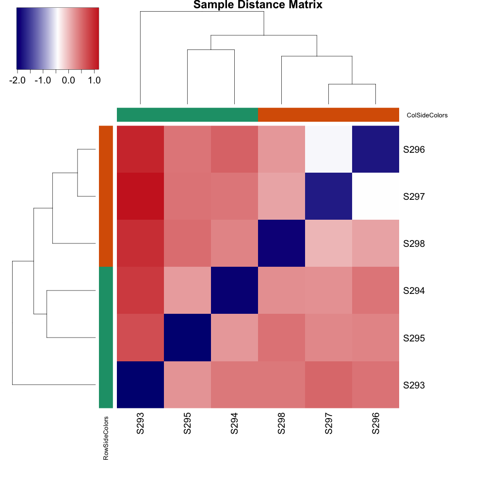

# Differential Gene Expression analysis #

There are many programs that you can use to perform differential expression Some of the popular ones for RNA-seq are [`DESeq2`](https://bioconductor.org/packages/release/bioc/html/DESeq2.html),[`edgeR`](http://bioconductor.org/packages/release/bioc/html/edgeR.html), or [`QuasiSeq`](https://cran.r-project.org/web/packages/QuasiSeq/index.html). Here we will demonstrate differential expression using DESeq2.


### Differential Expression with DESeq2 ###
These steps should be done either on RStudio or in R terminal:

```
## RNA-seq analysis with DESeq2
## Largely based on Stephen Turner, @genetics_blog
## https://gist.github.com/stephenturner/f60c1934405c127f09a6

source("http://bioconductor.org/biocLite.R")
biocLite("DESeq2")
library("DESeq2")


setwd("~/Atrx/")
dat<-read.table("At_count.txt",header = T,quote = "",row.names = 1)

# Convert to matrix
dat <- as.matrix(dat)
head(dat)

# Assign condition (first three are WT, next three are mutants)

condition <- factor(c(rep("WT",3),rep("Mut",3)))
condition=relevel(condition,ref = "WT")


# Create a coldata frame: its rows correspond to columns of dat (i.e., matrix representing the countData)
coldata <- data.frame(row.names=colnames(dat), condition)

head(coldata)

#            condition
# S293        WT
# S294        WT
# S295        WT
# S296       Mut
# S297       Mut
# S298       Mut


##### DESEq pipeline, first the design and the next step, normalizing to model fitting
dds <- DESeqDataSetFromMatrix(countData = dat, colData = coldata,design=~ condition)


dds <- DESeq(dds)

# Plot Dispersions:
png("qc-dispersions.png", 1000, 1000, pointsize=20)
plotDispEsts(dds, main="Dispersion plot")
dev.off()
```

```
# Regularized log transformation for clustering/heatmaps, etc
rld <- rlogTransformation(dds)
head(assay(rld))
hist(assay(rld))

# Principal Components Analysis
plotpca(rld)
```

```

# Colors for plots below
## Ugly:
## (mycols <- 1:length(unique(condition)))
## Use RColorBrewer, better
library(RColorBrewer)
(mycols <- brewer.pal(8, "Dark2")[1:length(unique(condition))])

# Sample distance heatmap
sampleDists <- as.matrix(dist(t(assay(rld))))
library(gplots)
png("qc-heatmap-samples.png", w=1000, h=1000, pointsize=20)
heatmap.2(as.matrix(sampleDists), key=F, trace="none",
          col=colorpanel(100, "black", "white"),
          ColSideColors=mycols[condition], RowSideColors=mycols[condition],
          margin=c(10, 10), main="Sample Distance Matrix")
dev.off()
```

```
# Get differential expression results
res <- results(dds)
table(res$padj<0.05)

```
We observe 204 differentially expressed genes with adjusted p value <= 0.05
|FALSE|TRUE|
|---|---|
|6712|204|

```
## Order by adjusted p-value
res <- res[order(res$padj), ]
## Merge with normalized count data
resdata <- merge(as.data.frame(res), as.data.frame(counts(dds, normalized=TRUE)), by="row.names", sort=FALSE)
names(resdata)[1] <- "Gene"
head(resdata)
## Write results
write.csv(resdata, file="diffexpr-results.csv",quote = FALSE,row.names = F)

```
To get the first few rows do
`head -4 diffexpr-results.csv`

```
Gene,baseMean,log2FoldChange,lfcSE,stat,pvalue,padj,S293,S294,S295,S296,S297,S298
gene32459,4529.272154082,-2.06484914507321,0.288731491703117,-7.15145110390785,8.58653066559819e-13,5.93844460832771e-09,11073.6705141816,5726.45128024,5128.92211910988,1482.46794888894,1473.13299530101,2290.98806677055
gene38073,36575.3870282423,-1.38271999532283,0.199996648356586,-6.91371583816493,4.7212044436934e-12,1.63259249662918e-08,60993.4651420719,43969.9190693109,53655.982748808,21424.5919655829,22323.7590351868,17084.604208493
gene1446,62.2619789946306,-2.86730516347734,0.43036495871904,-6.66249680738816,2.69214169069523e-11,6.20628397761607e-08,186.819432107996,65.9054495168287,73.2220377206551,12.4735356867937,10.8379903446028,24.3134285909079

```


```

## Examine plot of p-values
hist(res$pvalue, breaks=50, col="grey")


## MA plot
## Could do with built-in DESeq2 function:
## DESeq2::plotMA(dds, ylim=c(-1,1), cex=1)
## This is Stephen Turner's code:
maplot <- function (res, thresh=0.05, labelsig=TRUE, textcx=1, ...) {
  with(res, plot(baseMean, log2FoldChange, pch=20, cex=.5, log="x", ...))
  with(subset(res, padj<thresh), points(baseMean, log2FoldChange, col="red", pch=20, cex=1.5))
  if (labelsig) {
    require(calibrate)
    with(subset(res, padj<thresh), points(baseMean, log2FoldChange, labs=Gene, cex=textcx, col=2))
  }
}
png("diffexpr-maplot.png", 1500, 1000, pointsize=20)
maplot(resdata, main="MA Plot")
dev.off()
```

```
## Plots to Examine Results:

## Volcano plot with "significant" genes labeled
volcanoplot <- function (res, lfcthresh=2, sigthresh=0.05, main="Volcano Plot", legendpos="bottomright", labelsig=TRUE, textcx=1, ...) {
  with(res, plot(log2FoldChange, -log10(pvalue), pch=20, main=main, ...))
  with(subset(res, padj<sigthresh ), points(log2FoldChange, -log10(pvalue), pch=20, col="red", ...))
  with(subset(res, abs(log2FoldChange)>lfcthresh), points(log2FoldChange, -log10(pvalue), pch=20, col="orange", ...))
  with(subset(res, padj<sigthresh & abs(log2FoldChange)>lfcthresh), points(log2FoldChange, -log10(pvalue), pch=20, col="green", ...))
  if (labelsig) {
    require(calibrate)
    with(subset(res, padj<sigthresh & abs(log2FoldChange)>lfcthresh), points(log2FoldChange, -log10(pvalue), labs=Gene, cex=textcx, ...))
  }
  legend(legendpos, xjust=1, yjust=1, legend=c(paste("FDR<",sigthresh,sep=""), paste("|LogFC|>",lfcthresh,sep=""), "both"), pch=20, col=c("red","orange","green"))
}
png("diffexpr-volcanoplot.png", 1200, 1000, pointsize=20)
volcanoplot(resdata, lfcthresh=1, sigthresh=0.05, textcx=.8, xlim=c(-2.3, 2))
dev.off()
```

