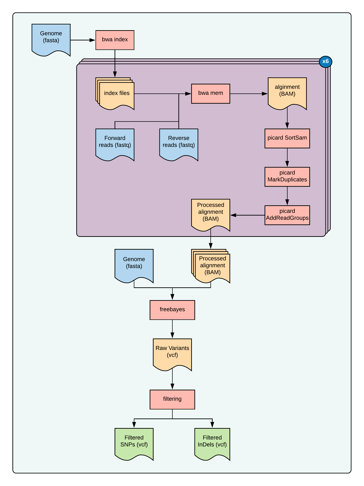

# FreeBayes variant calling workflow for DNA-Seq

## Introduction

`freebayes` is a Bayesian genetic variant detector designed to find small polymorphisms, specifically SNPs (single-nucleotide polymorphisms), indels (insertions and deletions), MNPs (multi-nucleotide polymorphisms), and complex events (composite insertion and substitution events) smaller than the length of a short-read sequencing alignment [Garrison and Marth, 2012](https://arxiv.org/abs/1207.3907)).

## Dataset

For this tutorial we will use the dataset from BioProject [PRJNA283785](https://www.ncbi.nlm.nih.gov/bioproject/PRJNA283785). This dataset has Illumina short reads for six different ecotypes of _Arabidopsis thaliana_ (`002185_Limeport-CC8070`, `002186_Limeport-CC28464`, `002187_Santa-Clara-CC8069`, `002188_Santa-Clara-CC28722`, `002189_Berkley-CC8068`, `002190_Berkley-CC28067`) and was originally used for re-evaluation of reported metal tolerance of _Arabidopsis thaliana_ accessions. These reads were sequenced on Illumina HiSeq 2000, with genomic DNA (WGS), random selection, paired layout, library strategy,


**Table 1: Dataset used for freebayes SNP calling.**

| Run        | SampleName                 | ReadPairs  | TotalBases    | ReadLength |
|:-----------|:---------------------------|------------|--------------:|-----------:|
| SRR2032874 | 002185_Limeport-CC8070     | 17,116,111 | 4,922,884,384 | 287        |
| SRR2032873 | 002186_Limeport-CC28464    | 23,125,667 | 6,639,673,875 | 287        |
| SRR2032879 | 002187_Santa-Clara-CC8069  | 16,919,754 | 4,859,908,587 | 287        |
| SRR2032877 | 002188_Santa-Clara-CC28722 | 20,847,502 | 5,994,626,199 | 287        |
| SRR2032876 | 002189_Berkley-CC8068      | 18,613,942 | 5,348,144,580 | 287        |
| SRR2032875 | 002190_Berkley-CC28067     | 17,702,502 | 5,089,062,686 | 287        |

We will download the files as follows:

`srr.ids`
```
SRR2032874
SRR2032873
SRR2032879
SRR2032877
SRR2032876
SRR2032875

```
```bash
module load sra-toolkit
module load parallel
parallel -a srr.ids prefetch --max-size 50GB
parallel -a srr.ids fastq-dump --split-files --origfmt --gzip
```

Since reference genome of _Arabidopsis_ is [available](http://plants.ensembl.org/Arabidopsis_thaliana/Info/Index) here, we will use it as reference for mapping. We will have to download the genome from the database

```bash
wget ftp://ftp.ensemblgenomes.org/pub/plants/release-44/fasta/arabidopsis_thaliana/dna/Arabidopsis_thaliana.TAIR10.dna.toplevel.fa.gz
gunzip Arabidopsis_thaliana.TAIR10.dna.toplevel.fa.gz
```

These datasets are all we need to get started. Although, the SRA download through `prefetch` is faster, it takes long time for converting `sra` file to `fastq` using `fastq-dump`. Alternatively, you can obtain and download `fastq` files directly form [European Nucleotide Archive (ENA)](https://www.ebi.ac.uk/ena/data/view/PRJEB18647). The links are saved [here](assets/ena-links.txt) if you want to use them instead (note the IDs are different, but they are from the same study and the results will be identical regardless of what data you use)

## Organization

The files and folders will be organized as follows:

```
freebayes
├── 0_index
│   └── Arabidopsis_thaliana.TAIR10.dna.toplevel.fa
├── 1_data
│   ├── SRR2032873_1.fastq.gz
│   ├── SRR2032873_2.fastq.gz
│   ├── SRR2032874_1.fastq.gz
│   ├── SRR2032874_2.fastq.gz
│   ├── SRR2032875_1.fastq.gz
│   ├── SRR2032875_2.fastq.gz
│   ├── SRR2032876_1.fastq.gz
│   ├── SRR2032876_2.fastq.gz
│   ├── SRR2032877_1.fastq.gz
│   ├── SRR2032877_2.fastq.gz
│   ├── SRR2032879_1.fastq.gz
│   ├── SRR2032879_2.fastq.gz
│   └── srr.ids
├── 2_fastqc
├── 3_mapping
├── 4_processing
├── 5_freebayes
└── 6_filtering
```

## Overview


Fig 1: overview of this tutorial


### Step 0: Quality check the files

Soft link the fastq files and run FASTQC on them:

```bash
cd 2_fastqc
for fq in ../1_data/*.fastq.gz; do
  ln -s $fastq
done
module load parallel
module load fastqc
parallel "fastqc {}"" ::: *.fastq
```

you can examine the results by opening each html page or you can merge them to a single report using multiqc. The data seems [satisfactory](assets/fastqc-freebayes), so we will proceed to next step.

### Step 1: Map the raw reads to the genome

```bash
cd 3_mapping
for fq in ../1_data/*.fastq.gz; do
  ln -s $fq
done
```
Make a run script for alignment:

```bash
#!/bin/bash
genome=$1
read1=$2
read2=$3
out=$(echo $2 |sed 's/_1.fastq.gz/.bam/g')
module load bwa
module load samtools
bwa mem -M -t 16 $genome $read1 $read2 | samtools view -buS - > ${out}
```
Create commands:

```bash
for r1 in *_1.fastq.gz; do
  r2=$(echo $r1 |sed 's/_1.fastq.gz/_2.fastq.gz/g')
  genome="../0_index/Arabidopsis_thaliana.TAIR10.dna.toplevel.fa"
  echo "./runBWA.sh $genome $r1 $r2" ;
done > bwa.cmds
```
make SLURM scripts and submit

```bash
makeSLURMs.py 1 bwa.cmds
for sub in *.sub; do
  sbatch $sub;
done
```

### Step 2: Process BAM files

In this step, we will sort the BAM files from previous step, add readgroups and mark duplicates in them.

Soft-link the files

```bash
cd 4_processing
for bam in ../3_mapping/*.bam; do
  ln -s $bam;
done
```

Make a run script for processing bam files

```bash
#!/bin/bash
bam=$1
name=$2
module load picard
module load samtools

picard SortSam \
      I=${bam} \
      O=${bam%.*}-sorted.bam \
      SORT_ORDER=coordinate

picard MarkDuplicates \
      I=${bam%.*}-sorted.bam \
      O=${bam%.*}-sorted-md.bam \
      M=${bam%.*}-md-metrics.txt

picard AddOrReplaceReadGroups \
      I=${bam%.*}-sorted-md.bam \
      O=${bam%.*}-sorted-md-rg.bam \
      RGID=${bam%.*} \
      RGLB=${name} \
      RGPL=illumina \
      RGPU=unit1 \
      RGSM=${name}

samtools index ${bam%.*}-sorted-md-rg.bam
```
you need a `names.txt` file with:

```
SRR2032874	Limeport-CC8070
SRR2032873	Limeport-CC28464
SRR2032879	Santa-Clara-CC8069
SRR2032877	Santa-Clara-CC28722
SRR2032876	Berkley-CC8068
SRR2032875	Berkley-CC28067
```
Now create commands:

```bash
while read a b; do
  echo "./runProcessing.sh ${a}.bam ${b}"
done > process.cmds
```

make SLURM scripts and submit

```bash
makeSLURMs.py 1 process.cmds
for sub in *.sub; do
  sbatch $sub;
done
```

Now we are ready to call SNPs on these bam files!

### Step 3: Run freebayes

Next is to run the actual variant calling program, whcih is the `freebayes`. We run this on all your processed bam files (alignment data) simultaneously. This will generate a single VCF file. The default settings should work for most use cases, but if your samples are not diploid, then you need to set the `--ploidy` and adjust the `--min-alternate-fraction` accordingly.

```bash
cd 5_freebayes
for bam in ../4_processing/*-md-rg.bam*; do
  ln -s $bam;
done
```

Make a run script for freebayes (`runFreeBayes.sh`):

```bash
#!/bin/bash
ref="../0_index/Arabidopsis_thaliana.TAIR10.dna.toplevel.fa"
module load freebayes
ls *-md-rg.bam > bam.fofn
freebayes \
  --fasta-reference ${ref} \
  --bam-list bam.fofn \
  --vcf output.vcf \
```

make SLURM scripts and submit

```bash
echo "./runFreeBayes.sh" > freebayes.cmds
makeSLURMs.py 1 freebayes.cmds
sbatch freebayes_0.sub
```

When this completes, you will have the `output.vcf` file. This is your unfiltered raw variants file.

### Step 4: filter the VCF file
