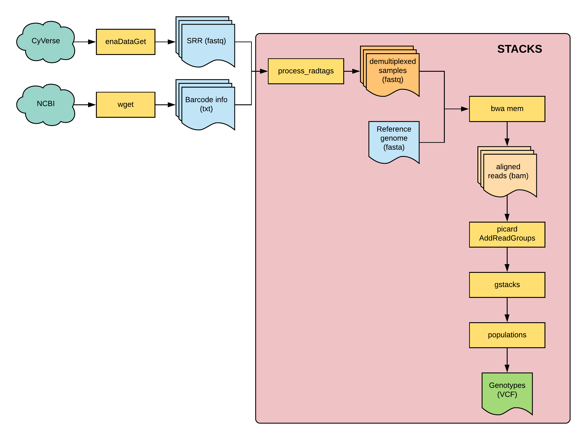

# SNP calling for GBS data using Stacks pipeline

## Introduction
Genotyping-by-sequencing (GBS) is a technique that allows to rapidly detect nucleotide variation  across the whole genome. This allows to genotype large number of individuals, simultaneously, at a very low cost as this is a reduced representation of the genome. It can work with or without a reference genome, and easily generates large number of useful information for these individuals at population level.

## Dataset
In this tutorial, we will use NAM population GBS data generated by _[Rodgers-Melnick et al.](http://dx.doi.org/10.1073/pnas.1413864112)_. This GBS data is collected from 5000 RIL individuals belonging to NAM population (25 diverse maize lines crossed to B73). Originally, SNPs were called using B73 V3 genome and the results were used for various purposes. Since there is more latest version of the genome, we can replicate the same analyses, using a different tool (Stacks) and an updated genome. In the next tutorial we will create a tutorial for calling SNPs using Tassel.

The dataset for this GBS is available on NCBI [SRP009896](https://www.ncbi.nlm.nih.gov/sra/?term=SRP009896) and there are 91 SRRs associated with it. [The metadata for these SRRs](http://cbsusrv04.tc.cornell.edu/users/panzea/download.aspx?filegroupid=4) are available on CyVerse Data Commons, at this location:
```
/iplant/home/shared/panzea/genotypes/GBS/v27/
```
Specifically, you will need `AllZeaGBSv2.7_publicSamples_metadata20140411.xlsx` file present in that directory. This file is essential not only to demultiplex the SRR data you download, but also, if you are interested in doing downstream analyses it will tell the sample pedigree information.

## Organization

The data is organized as follows:
```
stacks/
├── 1-data
├── 2-genome
└── 3-stacks
    ├── a-barcodes
    ├── b-demux
    ├── c-alignments
    ├── d-gstacks
    └── e-population
```
## Programs required


## Overview


**Fig 1: overview of this tutorial**

## Organize datasets

### Fastq

First, download the 91 SRR datasets from the SRA database. For this you can use the `NCBI-edirect` package to obtain the list of SRRs and then `enaBrowserTools` to download them.

```bash
cd stacks/1-data
esearch -db sra -query SRP009896  |\
  efetch --format runinfo |\
  cut -d , -f 1 |\
  awk 'NF>0' |\
  grep -v Run > srr.ids
while read line; do
  enaDataGet -f fastq -a $line;
done<srr.ids
```
This will generate 91 folders with single fastq (compressed) file each.

### Barcodes

From the [spreadsheet](http://cbsusrv04.tc.cornell.edu/users/panzea/download.aspx?filegroupid=4) downloaded, you will need to extract the required information (`flowcell`, `lane`, `barcode`, and `samplename`) and generate a simple text file.  You can use the SRR id for the flowcell to make the analyses simpler. If you have the same `samplename` Since there will be samples with same `samplename` in multiple SRR files, we need to process them separately. The combined, extracted, and cleaned barcode file is provided here in its [final form](assets/barcodes-gbs-data.tsv) for reference. If you have your own data, it is essential that you create the barcode file in similar format. This file is placed in `3-stacks` directory and it will be split into multiple files based on SRR ids.

```bash
cd 3-stacks
while read line; do
  grep -Fw '$line' barcodes-gbs-data.tsv > a-barcodes/${line}-barcodes.txt;
done<../1-data/srr.ids
```

### Genome

B73 version 4 from Gramene, download and BWA index:

```bash
cd 2-genome
wget ftp://ftp.gramene.org/pub/gramene/CURRENT_RELEASE/fasta/zea_mays/dna/Zea_mays.B73_RefGen_v4.dna.toplevel.fa.gz
gunzip Zea_mays.B73_RefGen_v4.dna.toplevel.fa.gz
module load bwa
bwa index Zea_mays.B73_RefGen_v4.dna.toplevel.fa
```

## Demulitplex

Now, we are ready to start the `Stacks` pipeline. We will first start by demultiplexing.

```bash
module load gcc/7.3.0-xegsmw4
module load stacks
for srr in ../1-data/SRR*; do
  ID=$(basename $srr);
  echo process_radtags -p ../1-data/${ID}/ -o ./b-demux/${ID}/ -b ./a-barcodes/${ID}-barcodes.txt -e apeKI -r -c -q;
done > process.cmds
```
Make Slurm scripts and submit
makeSLURMp.py 350 process.cmds

```bash
for sub in process*.sub; do
  sed -i 's/parallel -j 1/parallel -j 20/g' $sub;
  sbatch $sub
done
```

## Align reads to genome

We will use BWA program for alignments

create a run script `runBWA.sh`

```bash
#!/bin/bash
module load bwa
input=$1
output=$(basename $input | sed 's/.fq.gz/.sam/g')
index=/path/to/stacks/2-genome/Zea_mays.B73_RefGen_v4.dna.toplevel.fa
bwa mem -t 4 ${index} ${input} > c-alignments/${output}
```

Generate commands and submit:

```bash
for fq in $(find /path/to/stacks/3-stacks/b-demuxed -name "*.gz"); do
  echo ./run-bwa.sh $fq;
done > bwa.cmds
makeSLURMp.py 350 bwa.cmds
for sub in bwa*.sub; do
  sed -i 's/parallel -j 1/parallel -j 9/g' $sub;
  sbatch $sub
done
```

Alignments will be written to `c-alignments` directory.


## Calling SNPs

For the GBS SNP calling pipeline, you need to have coordinate sorted bam file with readgroups added to the BAM header. We will do this using `samtools` and `picard`

script `runSort-and-addReadgroups.sh`

```
#!/bin/bash
SAM="$1"
samtools view --threads 36 -b -o ${SAM%.*}.bam ${SAM}
samtools sort -o ${SAM%.*}_sorted.bam -T ${SAM%.*}_temp ${SAM%.*}.bam
module load picard
REF="/path/to/stacks/2-genome/Zea_mays.B73_RefGen_v4.dna.toplevel.fa"
ulimit -c unlimited
# example file looks like this:
# Z002E0081-SRR391089_sorted.bam
bam="${SAM%.*}_sorted.bam"
RGID=$(basename $bam | rev | cut -f 1 -d "-" | rev | sed 's/_sorted.bam//g')
RGSM=$(basename $bam | rev | cut -f 2- -d "-" | rev )
RGLB="${RGSM}-L001"
RGPU=001
echo -e "$RGID\t$RGSM\t$RGLB\t$RGPU"
java -Djava.io.tmpdir=$TMPDIR -Xmx50G -jar $PICARD_HOME/picard.jar AddOrReplaceReadGroups \
      I=${bam} \
      O=${bam%.*}_new.bam \
      RGID=$RGSM \
      RGLB=$RGLB \
      RGPL=ILLUMINA \
      RGPU=$RGPU \
      RGSM=$RGSM
module load samtools
samtools index ${bam%.*}_new.bam
```

generate commands and submit:

```bash
for sam in *.sam; do
  echo "./runSort-and-addReadgroups.sh $sam";
done > sort.cmds
makeSLURMp.py 350 sort.cmds
for sub in sort*.sub; do
  sed -i 's/parallel -j 1/parallel -j 9/g' $sub;
  sbatch $sub
done
```

Next, we run `gstacks`. This has to be run on all bam files together. So to the command generated will be really long:

```bash
for bam in *_new.bam; do
  echo -n "-B $bam "
done > middle
```
head file `head`
```
#!/bin/bash
ml purge
ml gcc/7.3.0-xegsmw4
ml stacks
gstacks
```

tail file `tail`
```
-O /path/to/stacks/3-stacks/d-gstacks -t 36
```
combine:

```bash
cat head middle tail >> gstacks.cmds
# edit this file to remove newline
makeSLURMs.py 1 gstacks.cmds
sbatch gstacks_0.sub
```

Finally, run the `populations` script:

```
#!/bin/bash
ml purge
ml gcc/7.3.0-xegsmw4
ml stacks
input="/path/to/stacks/3-stacks/d-gstacks"
output="/path/to/stacks/3-stacks/e-population"
populations \
   -P ${input} \
   -O ${output} \
   -t 36 \
   --batch-size 10 \
   --vcf \
   --phylip
```

This will generate the results.
