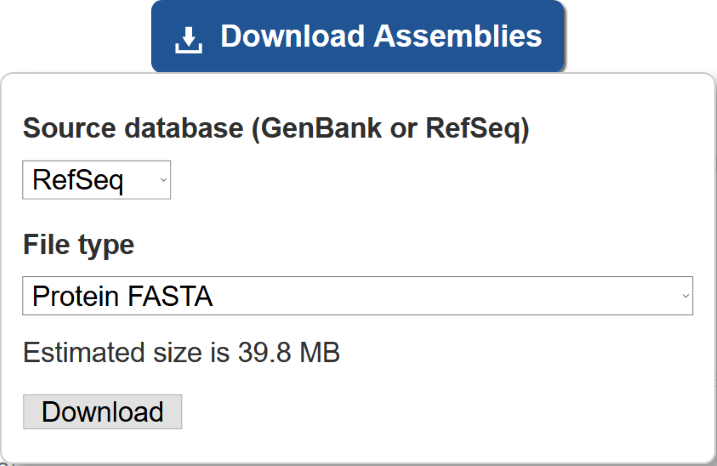
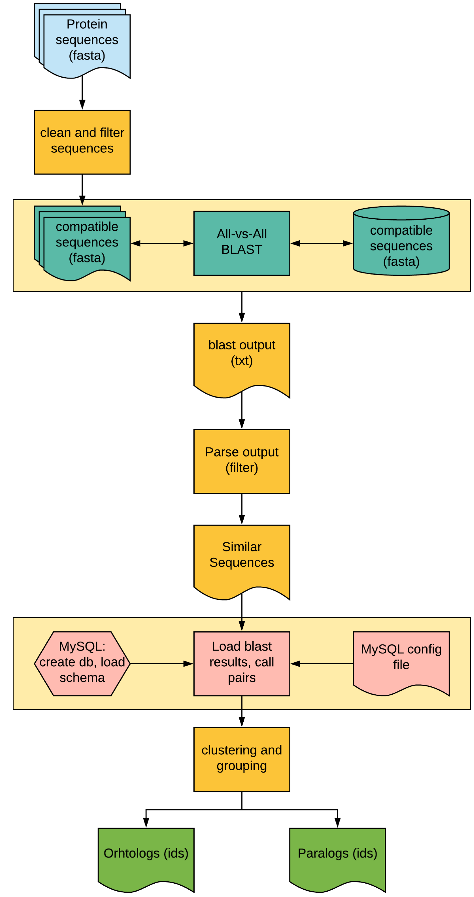

# Finding orthologs using OrthoMCL program

This is the first section of Phylogenomics chapter, where we predict orthologs from the gene predictions for carrying out downstream analysis. We will use OrthoMCL program for this purpose, using the Singularity container. We will use many different species of plasmodium as an example dataset for this exercise.

Following is the outline for this chapter:

1. Obtaining the data
2. Cleaning and formating sequences
3. Running orthoMCL program
4. Formatting and processing results (for downstream analysis)


### Downloading data

At the time of writing this tutorial, there were 13 RefSeq assemblies available on [NCBI](https://www.ncbi.nlm.nih.gov/assembly/?term=txid5820%5BOrganism%3Aexp%5D), with chromosomal level assembly. We will use them all for finding orthologs. Although we will only need the protein sequences for this section, we will also download the CDS sequences that is necessary for other sections following this chapter. This step may vary if you want to use another dataset or custom dataset.



Download it and extract the archive using `tar` command, and explore the contents.

```
tar xf genome_assemblies.tar
cd
grep -c ">" *.faa
```

Following is the summary:

| Filename                                               | Species                         | Sequences |
|:-------------------------------------------------------|---------------------------------|---------:|
| GCF_000002415.2_ASM241v2_protein.faa                   | *Plasmodium vivax* Sal-1        | 5,392    |
| GCF_000002765.4_ASM276v2_protein.faa                   | *Plasmodium falciparum* 3D7     | 5,392    |
| GCF_000006355.1_ASM635v1_protein.faa                   | *Plasmodium knowlesi* strain H  | 5,101    |
| GCF_000321355.1_PcynB_1.0_protein.faa                  | *Plasmodium cynomolgi* strain B | 5,716    |
| GCF_000524495.1_Plas_inui_San_Antonio_1_V1_protein.faa | *Plasmodium inui* San Antonio 1 | 5,832    |
| GCF_000709005.1_Plas_vinc_vinckei_V1_protein.faa       | *Plasmodium vinckei vinckei*    | 4,954    |
| GCF_000956335.1_Plas_frag_nilgiri_V1_protein.faa       | *Plasmodium fragile*            | 5,672    |
| GCF_001601855.1_ASM160185v1_protein.faa                | *Plasmodium reichenowi*         | 5,279    |
| GCF_001602025.1_ASM160202v1_protein.faa                | *Plasmodium gaboni*             | 5,354    |
| GCF_001680005.1_ASM168000v1_protein.faa                | *Plasmodium coatneyi*           | 5,516    |
| GCF_900002335.2_PCHAS01_protein.faa                    | *Plasmodium chabaudi chabaudi*  | 5,158    |
| GCF_900002375.1_PBANKA01_protein.faa                   | *Plasmodium berghei* ANKA       | 4,896    |
| GCF_900002385.1_PY17X01_protein.faa                    | *Plasmodium yoelii*             | 5,926    |

### Cleaning and formatting the data to desired specifications

Next step is to clean up this data so that it is easier to handle for both program and for the user. Since these files are identified by accessing id, we will rename them to some easily readable name. We will use the first 4 letters of genus name and first 4 letters of spp name (eg: `plaviva` for *Plasmodium vivax* Sal-1).

#### Files before:
```
$ ls -1
GCF_000002415.2_ASM241v2_protein.faa
GCF_000002765.4_ASM276v2_protein.faa
GCF_000006355.1_ASM635v1_protein.faa
GCF_000321355.1_PcynB_1.0_protein.faa
GCF_000524495.1_Plas_inui_San_Antonio_1_V1_protein.faa
GCF_000709005.1_Plas_vinc_vinckei_V1_protein.faa
GCF_000956335.1_Plas_frag_nilgiri_V1_protein.faa
GCF_001601855.1_ASM160185v1_protein.faa
GCF_001602025.1_ASM160202v1_protein.faa
GCF_001680005.1_ASM168000v1_protein.faa
GCF_900002335.2_PCHAS01_protein.faa
GCF_900002375.1_PBANKA01_protein.faa
GCF_900002385.1_PY17X01_protein.faa
```
##### script to rename files

```
for faa in *.faa; do
new=$(head -n 1 ${faa} |grep -wEo "Plasmodium .*\b" |cut -f 1-2 -d " "| sed 's/\(\w\w\w\w\)\w*\( \|$\)/\1/g');
mv ${faa} ${new}.fasta;
done
```
#### Files after:

```
Plasberg.fasta
Plaschab.fasta
Plascoat.fasta
Plascyno.fasta
Plasfalc.fasta
Plasfrag.fasta
Plasgabo.fasta
Plasinui.fasta
Plasknow.fasta
Plasreic.fasta
Plasvinc.fasta
Plasviva.fasta
Plasyoel.fasta
```

Next, we will clean the sequence headers. Although this is not absolutely required for these files, when using custom files it is necessary to keep consistency among all the files being used for the analysis. Here our file fasta header looks like this (all 13 are from NCBI and they are consistent)

#### Headers before:

```
$ head -n 1 *.fasta |grep "^>"
>XP_022711843.1 BIR protein, partial [Plasmodium berghei ANKA]
>XP_016652856.1 CIR protein [Plasmodium chabaudi chabaudi]
>XP_019912384.1 Dual specificity phosphatase [Plasmodium coatneyi]
>XP_004220499.1 hypothetical protein PCYB_021010, partial [Plasmodium cynomolgi strain B]
>XP_001347288.1 erythrocyte membrane protein 1, PfEMP1 [Plasmodium falciparum 3D7]
>XP_012333075.1 hypothetical protein AK88_00001, partial [Plasmodium fragile]
>XP_018638642.1 putative EMP1-like protein, partial [Plasmodium gaboni]
>XP_008813840.1 hypothetical protein C922_00001 [Plasmodium inui San Antonio 1]
>XP_002257498.1 SICA antigen (fragment), partial [Plasmodium knowlesi strain H]
>XP_012760262.2 rifin [Plasmodium reichenowi]
>XP_008621913.1 hypothetical protein YYE_00001, partial [Plasmodium vinckei vinckei]
>XP_001608309.1 hypothetical protein [Plasmodium vivax Sal-1]
>XP_022810663.1 YIR protein [Plasmodium yoelii]
```
#### Script to modify headers:

```
for fasta in *.fasta; do
cut -f 1 -d " " $fasta > ${fasta%.*}.temp;
mv ${fasta%.*}.temp $fasta
done
```

#### Headers after:

```
$ head -n 1 *.fasta |grep "^>"
>XP_022711843.1
>XP_016652856.1
>XP_019912384.1
>XP_004220499.1
>XP_001347288.1
>XP_012333075.1
>XP_018638642.1
>XP_008813840.1
>XP_002257498.1
>XP_012760262.2
>XP_008621913.1
>XP_001608309.1
```

### Running OrthoMCL program

Since we don't want to setup/configure a MySQL server we will use a `docker` container (using the `singularity` program) for running. We will also use another container with all the OrthoMCL programs installed in it.

```
module load singularity
singularity pull --name orthomcl.simg shub://ISU-HPC/orthomcl
```

This will create 2 `img` files (containers) for the mysql and orthoMCL
```
mysql-5.7.20.img
orthomcl.img
```



**Fig 2:**  Overview of OrthoMCL pipeline. Here, all orange boxes will per performed using the `orthomcl.img` singularity container and pink boxes in `mysql-5.7.20.img`. The BLAST analysis (yellow box) will be done outside the container to speed up the process.

#### 1. Clean and filter sequences

For this, we will create a directory where we store the formatted and filtered sequences. We will use `orthomclAdjustFasta` and `orthomclFilterFasta` for these steps.

```
mkdir -p original complaintFasta
mv *.fasta original/
singularity shell orthomcl.img
cd complaintFasta
for fasta in ../orginal/*.fasta; do
orthomclAdjustFasta $(basename ${fasta%.*}) ${fasta} 1
done
```

The arguments supplied here are the 8 letter prefix for each file, input file and the field in the fasta file that should be used as identifier (in our case it was the first number so it is  `1`).

For filtering, we will create another directory and save files there:

```
cd ..
orthomclFilterFasta complaintFasta 10 20
```

Here, `10` is the minimum length for protein to keep and `20` is the maximum allowed stop codons in the sequences. This command will generate 2 files: `goodProteins.fasta`, containing all proteins that passed the filtering and `poorProteins.fasta`, containing all rejects.

We can now exit the singularity image shell and run the next step on a cluster.

```
exit
```

#### 2. Find similar sequences using BLAST

Depending the size of sequences, you can either split the `goodProteins.fasta` file to smaller bits and run the `blast` step in parallel or run it as single query file against single database (much slower). Here we will just split them to 4 pieces and run them all in a single slurm job.

Load the module and create blast database

```
module load ncbi-blast
makeblastdb -in goodProteins.fasta -dbtype prot -parse_seqids -out goodProteins.fasta
```
Split the fasta file to 4 parts
```
fasta-splitter.pl --n-parts 4 goodProteins.fasta
```

Generate commands for blast
```
for split in goodProteins.part-?.fasta; do
echo "blastp -db goodProteins.fasta -query ${split} -outfmt 6 -out ${split}.tsv -num_threads 4";
done > blastp.cmds
```
Create SLURM submission script and submit the jobs
```
makeSLURMp.py 4 blastp.cmds
for sub in *.sub; do
sbatch $sub;
done
```

Once these jobs complete, you can merge the results to a single file

```
cat goodProteins.part-?.fasta.tsv >> blastresults.tsv
```

The scripts mentioned here are available on our GitHub repo `common_scripts`

We will now convert the blast results to format that is needed for uploading to MySQL database

```
orthomclBlastParser blastresults.tsv ./complaintFasta/ >> similarSequences.txt
```
This will generate `similarSequences.txt` file that we will load to MySQL db.


#### 3. Finding Orthologs:


In this section, we will:

1. Set up the MySQL config file so that orthoMCL knows how to access the database for storing/retrieving information
2. Start the MySQL server on the container
3. Setup database/tables for orthoMCL
4. Load the BLAST results and call pairs
5. Dump the results (pairs) from the MySQL db as a text file
6. Stop the server
7. Run clustering program (MCL)

**Setting up config file**

This is a simple text file, which provides information for OrthoMCL program about, the database and table name to which you're loading the blast results, username and password for the MySQL server and some settings (that you can change)

You can create one as follows:
```
cat > orthomcl.config <<END
dbVendor=mysql
dbConnectString=dbi:mysql:orthomcl:mysql_local_infile=1:localhost:3306
dbLogin=root
dbPassword=my-secret-pw
similarSequencesTable=SimilarSequences
orthologTable=Ortholog
inParalogTable=InParalog
coOrthologTable=CoOrtholog
interTaxonMatchView=InterTaxonMatch
percentMatchCutoff=50
evalueExponentCutoff=-5
oracleIndexTblSpc=NONE
END
```

or download the one from [here](https://raw.githubusercontent.com/ISU-HPC/orthomcl/master/orthomcl.config):
```
curl \
https://raw.githubusercontent.com/ISU-HPC/orthomcl/master/orthomcl.config > orthomcl.config
```
**Start MySQL server**

We use a singularity instance (new feature in version 2.4) to run the MySQL server service.

```
module load singularity
singularity pull --name mysql.simg shub://ISU-HPC/mysql
```

Create local directories for MySQL. These will be bind-mounted into the container and allow other
containers to connect to the database via a local socket as well as for the database to be stored on the
host filesystem and thus persist between container instances.

```
mkdir -p ${PWD}/mysql/var/lib/mysql ${PWD}/mysql/run/mysqld
```

Start the singularity instance for the MySQL server
```
singularity instance.start --bind ${HOME} \
--bind ${PWD}/mysql/var/lib/mysql/:/var/lib/mysql \
--bind ${PWD}/mysql/run/mysqld:/run/mysqld \
./mysql.simg mysql
```

Run the container startscript to initialize and start the MySQL server. Note that initialization is only done the first time and the script will automatically skip initialization if it is not needed. This command must be run each time the MySQL server is needed (e.g., each time the container is spun-up to provide the MySQL server).
```
singularity run instance://mysql
```


**Setup database and tables (schema) for running orthoMCL**


create a database named `orhtomcl`

```
singularity exec instance://mysql mysqladmin create orthomcl
```


Since we already have the singularity image for the orthoMCL, we will use the scripts in there to install schema for the database and create all the necessary tables for running next steps.

```
singularity shell --bind $PWD \
  --bind ${PWD}/mysql/run/mysqld:/run/mysqld \
  ./orthomcl.simg
```
 install schema
 ```
 orthomclInstallSchema orthomcl.config
 ```


**Load BLAST results and call pairs**

Next, load the parsed blast results:

```
orthomclLoadBlast orthomcl.config similarSequences.txt
```

Call pairs:

```
orthomclPairs orthomcl.config pairs.log cleanup=no
```

**Get the results**

```
orthomclDumpPairsFiles orthomcl.config
```

The output will be a directory (called `pairs`) and a file (called `mclinput`). The pairs directory, will
contain three files: `orthologs.txt`, `coorthologs.txt`, `inparalogs.txt`. Each of these files describes
pair-wise relationships between proteins. They have three columns: `Protein 1`, `Protein 2` and
normalized similarity score between them. The `mclinput` file contains the identical information as
the three files in pairs directory but merged as a single file and in a format accepted by the mcl program.


**Stop the MySQL server**

Stopping server:

```
singularity instance.stop mysql
```

**Run the clustering program**

MCL program (Dongen 2000) will be used to cluster the pairs extracted in the previous steps to determine
ortholog groups.
```
mcl mclInput --abc -I 1.5 -o groups_1.5.txt
```
Here, `--abc` refers to the input format (tab delimited, 3 fields format), `-I` refers to inflation value and `-o` refers to output file name. Inflation value will determine how tight the clusters will be. It can range from 1 to 6, but most publications use values between 1.2 -1.5 for detecting orthologous groups.
The final step is to name the groups called by mcl program.

```
orthomclMclToGroups OG1.5_ 1000 < groups_1.5.txt > named_groups_1.5.txt
```
Here, `OG1.5_` is the prefix we use to name the ortholog group, `1000` is the starting number for the
ortholog group and last 2 fields are input and output file name respectively.


If you want to test this for other inflation values, you can create a loop and run these commands again:

```
for I in 2.0 2.5 3.0 3.5; do
mcl mclInput --abc -I $I -o groups_$I.txt;
orthomclMclToGroups OG$I_ 1000 < groups_$I.txt > named_groups_$I.txt;
done
```

### Formatting and processing results

Next, we will filter the results to select only 1:1 orthologs. For this, we will need a frequency table constructed form the `named_groups_1.5.txt` file.
